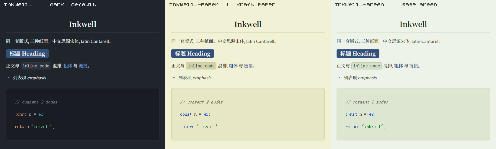

# Inkwell — a Typora theme

**English** · [中文](#中文说明)

A Typora theme in three colour schemes: a deep blue-black dark mode, plus two low-glare
paper modes (kraft yellow-green and sage green). Body text is set in **Source Han Serif**
(CJK) with **Cantarell** (Latin); code uses **JetBrains Mono** with JetBrains' own syntax
palettes — New Dark for the dark theme, New Light for the paper themes.

The name *Inkwell* comes from the ink pot: blue ink on paper, which is what the palette is.

```
inkwell          dark        deep blue-black, low-saturation blue accent
inkwell-paper    kraft       pale yellow-green paper
inkwell-green    sage        pale sage/bean-green paper
```



---

## Install

1. Open Typora → `File` → `Preferences` → `Appearance` → **Open Theme Folder**.
2. Copy **`inkwell.css` and the `inkwell` folder together** into that folder.
   The CSS loads its fonts from the same-named folder, so they must stay side by side.
3. Restart Typora and pick a theme from the **Themes** menu:
   `inkwell`, `inkwell-paper`, `inkwell-green`.

To use a paper variant, also copy `inkwell-paper.css` and/or `inkwell-green.css` into
the same folder. They pull in all shared rules via `@import "inkwell.css"`, so
`inkwell.css` **must** be present and in the same directory.

### What ends up in your theme folder

```
<theme folder>/
├── inkwell.css            dark — the base, required
├── inkwell-paper.css      low-glare · kraft yellow-green (optional)
├── inkwell-green.css      low-glare · sage green (optional)
└── inkwell/               fonts (required)
    ├── Cantarell-VF-fixed.otf
    ├── SourceHanSerifCN-Medium.ttf
    ├── SourceHanSerifCN-Bold.ttf
    └── JetBrainsMono-Regular.ttf
```

All four fonts are bundled — **nothing else to install**. If you already have JetBrains Mono
installed system-wide it will be preferred (it ships more weights); otherwise the bundled
Regular is used.

> **Naming rule.** Typora needs the theme CSS file name and its asset folder name to be
> identical — hence `inkwell.css` next to the `inkwell/` folder. Typora also derives the
> menu label from the file name, so `inkwell.css` appears as `inkwell`. If you prefer a
> different theme name, rename **both** the CSS file and the folder to the same new base
> name (e.g. `mytheme.css` + `mytheme/`) and update the `@import` line in the two paper
> variants.

---

## Colour schemes

The three CSS files differ only in colour variables — layout, fonts and type scale are
the same rules in all three.

| Role | Variable | `inkwell` dark | `inkwell-paper` kraft | `inkwell-green` sage |
| --- | --- | --- | --- | --- |
| Page | `--bg-color` | `#20242b` | `#f1f1d6` | `#eef3e9` |
| Editor frame | `--editor-bg-color` | `#1c1f26` | `#eaeacd` | `#e8eee2` |
| Sidebar | `--side-bar-bg-color` | `#181b21` | `#e7e7c8` | `#e4ead9` |
| Code block panel | `--block-bg-color` | `#191c22` | `#e7e7c6` | `#dde6d0` |
| Inline code chip | `--inline-code-bg-color` | `#2b3039` | `#d4d4a8` | `#d8e2c8` |
| Blockquote / front matter | `--quote-block-bg-color` | `#262b34` | `#eaeacb` | `#eaf0e4` |
| Body text | `--text-color` | `#dfe2e8` | `#38382a` | `#333a2f` |
| Borders | `--border-color` | `#333844` | `#d5d5b0` | `#d5ddc9` |
| Accent (h3–h5, rules, caret) | `--primary-color` | `#4a6fa5` | `#47709f` | `#47709f` |
| Links / secondary headings | `--primary-bright-color` | `#6e9bd1` | `#3f6396` | `#3f6396` |
| Bold / link hover | `--primary-hover-color` | `#5e86bd` | `#345587` | `#345587` |
| h1 / italic / active item | `--text-color-strong` | `#f0f2f5` | `#2b2b20` | `#2a3026` |
| h6 / strikethrough | `--text-color-muted` | `#9aa1ad` | `#626876` | `#5f6572` |
| h2 chip | `--header-span-color` | `#33507a` | `#33507a` | `#33507a` |

The accent `#4a6fa5` sits at about 217° hue with both saturation and lightness held low:
strong enough to carry emphasis and orientation, calm enough for long reading sessions.

### Design decisions in the paper variants

1. **Code blocks go light too.** The panel is one step darker than the page, in the same
   hue family — separation comes from panel tone, a border, rounded corners and the
   monospace face rather than from a dark slab.
2. **The whole syntax palette is swapped, not just the background.** JetBrains New Dark
   tokens are built for a dark field; on a light panel they collapse to **1.65–2.36:1**.
   The paper themes use JetBrains **New Light** (IntelliJ Light) instead, with a few
   values deepened. Every token reaches at least **4.5:1** against its panel
   (worst case 4.68:1 kraft / 4.51:1 sage), passing WCAG AA.
3. **Body text darkens with the background.** `--text-color` is near-white in the dark
   theme; on paper it becomes a dark ink matched to the same hue (10.4:1). Sidebar and
   menu text follow the same variable.
4. **Headings and emphasis darken as well.** This is the part that is easy to miss: in the
   dark theme the headings use *light* blues, which on paper measure **1.00–2.52:1** —
   effectively invisible. All heading and emphasis colours are re-derived for a light
   background. After the fix, h1 / italic / h3–h6 / bold / links are all **≥ 4.4:1**.
5. **Inline code gets its own pairing.** The dark theme's near-white inline-code text on a
   light chip was about **1.4:1**. Light variants use a dark blue-ink text on a deepened
   chip: **6.15:1** (kraft) / **6.42:1** (sage).

Three-step value ladder, kraft variant:

```
page #f1f1d6  →  code panel #e7e7c6  →  inline chip #d4d4a8
```

---

## Typography

| Role | Family |
| --- | --- |
| Body (Latin / digits) | Cantarell |
| Body (CJK) | Source Han Serif (思源宋体) |
| Headings, table headers, TOC | Source Han Serif |
| Code, inline code, link sources, front matter | JetBrains Mono |

Browsers fall back per glyph down the stack
`--font-family: "Cantarell", "SourceHanSerifCN", …`. Cantarell carries no hanzi, so Chinese
lands on Source Han Serif while Latin and digits stay in Cantarell — a sans-Latin with a
serif-CJK pairing.

## Layout (after Lapis)

- Body column 950px (1024px at ≥1400px, 1120px at ≥1800px), justified, line-height 1.75.
- `h1` centred with a bottom rule; `h2` is an inline **colour chip** (`#33507a`, light text,
  4px radius).
- Blockquote: 3px accent rule on the left over a tinted panel.
- Round task-list checkboxes with an accent tick; list markers at `#6d7b90`.
- Table headers in Source Han Serif with accent text; even rows lifted slightly.
- The red/yellow/green dots Lapis drew above code blocks are removed, for a cleaner
  JetBrains-editor look.

## Code blocks

Dark theme: panel `#191c22`, text `#b6c2d4`, JetBrains Mono, line-height 1.65, 8px radius,
using JetBrains **New Dark** tokens:

| Token | Colour | Variable |
| --- | --- | --- |
| keyword / atom | `#ce8e6d` | `--code-keyword` |
| function / def | `#57a8f5` | `--code-function` |
| string | `#6aab73` | `--code-string` |
| number | `#2cabb8` | `--code-number` |
| comment | `#7a7e85` (italic) | `--code-comment` |
| doc comment | `#5f826b` | `--code-doc-comment` |
| type / variable-2 / qualifier | `#c77dbb` | `--code-entity` |
| tag / attribute | `#d5b778` | `--code-tag` |
| variable / property / operator | `#a9b7c5` | `--code-variable` |
| link | `#5c92ff` | `--code-url` |
| invalid | `#f75464` | `--code-invalid` |

Line numbers use the accent, the caret is a 2px accent bar, selection is translucent accent.

The paper variants replace this entire palette with New Light equivalents; all three files
define the same set of token selectors, differing only in colour values.

> All three schemes also stop comments from being multi-coloured. CodeMirror tags numbers,
> strings and keywords *inside* a comment with both `cm-comment` and their own class, which
> chops a comment into several colours and looks like a rendering bug (e.g. the `2` in
> `// supports 2 modes` turning into a number colour). Comments now paint as one colour.

---

## Previews

`preview/` holds browser renders at Typora's real DOM structure, for checking colour and
type:

| File | What it shows |
| --- | --- |
| `preview-variants.png` | all three schemes side by side |
| `preview-dark.png` | full element tour, dark theme |
| `preview-kraft.png` | full element tour, kraft paper |
| `preview-sage.png` | full element tour, sage green |
| `code-blocks.png` | code block and syntax colours close up |
| `preview.html`, `code-blocks.html` | interactive pages — open in a browser |

> The relative paths between these pages and the CSS/font folders must stay intact.
> These are browser renders: good for judging colour, **not identical to Typora's own
> layout engine**. Do a final check in Typora with a real document.

---

## Customise

Everything adjustable lives in `:root` at the top of each file:

```css
:root {
  --primary-color: #4a6fa5;   /* change this one value to re-tint the whole theme */
  --bg-color: #20242b;        /* page background */
  --block-bg-color: #191c22;  /* code block panel */
  --font-family: "Cantarell", "SourceHanSerifCN", ...;
  --monospace: "JetBrains Mono", "JetBrainsMono", ...;
}
```

For the paper variants:

- To use a different paper tone, change `--bg-color` / `--editor-bg-color` /
  `--side-bar-bg-color` / `--surface-color` / `--quote-block-bg-color`, plus
  `--block-bg-color` (code panel) and `--inline-code-bg-color` (inline chip). Nudge the
  border and selection colours with them so warm and cool do not clash.
- The New Light token palette at the end of each paper file is the whole palette, not an
  optional switch. A darker paper raises token contrast; a lighter paper lowers it, in
  which case deepen the comment `#666666`, string `#067d17` and tag `#7a6800` a step.

Value ladder for reference (kraft):

```css
--bg-color: #f1f1d6;              /* page */
--block-bg-color: #e7e7c6;        /* code panel, one step darker */
--inline-code-bg-color: #d4d4a8;  /* inline chip, one step darker still */
```

To add another scheme, copy a paper variant and change only its colour values — no rules
need repeating:

```bash
cp inkwell-paper.css inkwell-mine.css
```

---

## Licence

Theme CSS is MIT (see `LICENSE`).

Bundled fonts keep their own licences:

- **Cantarell** — SIL Open Font License 1.1
- **Source Han Serif** — SIL Open Font License 1.1
- **JetBrains Mono** — SIL Open Font License 1.1

## Credits

- Layout skeleton (Cantarell + Source Han Serif, h2 chip, blockquote, TOC, task list):
  [typora-theme-lapis](https://github.com/YiNNx/typora-theme-lapis) by YiNN, MIT.
- Code block palette and JetBrains Mono usage:
  [typora-theme-jetbrains-dark](https://github.com/RavenZhong/typora-theme-jetbrains-dark)
  by RavenZhong, MIT.

---
---

# 中文说明

[English](#inkwell--a-typora-theme) · **中文**

一款 Typora 主题，含三套配色：深蓝黑深色版，外加两套护眼纸色（牛皮纸黄绿、淡豆沙绿）。
正文中文用**思源宋体**、拉丁用 **Cantarell**；代码用 **JetBrains Mono** 配 JetBrains
官方语法色 —— 深色版用 New Dark，纸色版用 New Light。

名字 *Inkwell* 取自墨水瓶：纸上蓝墨，正是这套配色的样子。

```
inkwell          深色    深蓝黑底, 低饱和蓝强调色
inkwell-paper    黄绿    淡黄绿纸面
inkwell-green    淡绿    淡豆沙绿纸面
```


---

## 安装

1. Typora → `文件` → `偏好设置` → `外观` → **打开主题文件夹**。
2. 把 **`inkwell.css` 和 `inkwell` 文件夹一起**复制进去（CSS 从同名文件夹加载字体，
   两者必须并排）。
3. 重启 Typora，在**主题**菜单里选择：`inkwell`、`inkwell-paper`、`inkwell-green`。

要用纸色版，再把 `inkwell-paper.css` / `inkwell-green.css` 复制到同一目录即可。
它们通过 `@import "inkwell.css"` 继承全部共用规则，所以 `inkwell.css`
**必须存在且同目录**。

### 装好后的目录

```
<主题文件夹>/
├── inkwell.css            深色版（基础，必需）
├── inkwell-paper.css      护眼 · 牛皮纸黄绿（可选）
├── inkwell-green.css      护眼 · 淡豆沙绿（可选）
└── inkwell/               字体（必需）
    ├── Cantarell-VF-fixed.otf
    ├── SourceHanSerifCN-Medium.ttf
    ├── SourceHanSerifCN-Bold.ttf
    └── JetBrainsMono-Regular.ttf
```

四款字体全部内嵌，**无需另装字体**。若本机已装 JetBrains Mono 会优先使用（字重更全），
否则回落到内嵌的 Regular。

> **命名规则。** Typora 要求主题 CSS 的文件名与它的资源文件夹名**完全一致** ——
> 所以是 `inkwell.css` 配 `inkwell/` 文件夹。Typora 同时用文件名作为菜单显示名，
> 因此 `inkwell.css` 在菜单里显示为 `inkwell`。想换成别的主题名，把 CSS 文件名和
> 文件夹名**一起**改成同一个新名字（例如 `mytheme.css` + `mytheme/`），
> 并同步改两个纸色版里的 `@import` 行即可。

---

## 三套配色

三份 CSS 只差颜色变量，版式、字体、字号规则完全一致。

| 用途 | 变量 | `inkwell` 深色 | `inkwell-paper` 黄绿 | `inkwell-green` 淡绿 |
| --- | --- | --- | --- | --- |
| 页面 | `--bg-color` | `#20242b` | `#f1f1d6` | `#eef3e9` |
| 编辑区外框 | `--editor-bg-color` | `#1c1f26` | `#eaeacd` | `#e8eee2` |
| 侧边栏 | `--side-bar-bg-color` | `#181b21` | `#e7e7c8` | `#e4ead9` |
| 代码块面板 | `--block-bg-color` | `#191c22` | `#e7e7c6` | `#dde6d0` |
| 行内代码 chip | `--inline-code-bg-color` | `#2b3039` | `#d4d4a8` | `#d8e2c8` |
| 引用块 / Front Matter | `--quote-block-bg-color` | `#262b34` | `#eaeacb` | `#eaf0e4` |
| 正文文字 | `--text-color` | `#dfe2e8` | `#38382a` | `#333a2f` |
| 边框 | `--border-color` | `#333844` | `#d5d5b0` | `#d5ddc9` |
| 主色（h3–h5 / 竖线 / 光标） | `--primary-color` | `#4a6fa5` | `#47709f` | `#47709f` |
| 链接 / 次级标题 | `--primary-bright-color` | `#6e9bd1` | `#3f6396` | `#3f6396` |
| 粗体 / 链接悬停 | `--primary-hover-color` | `#5e86bd` | `#345587` | `#345587` |
| h1 / 斜体 / 侧边栏选中 | `--text-color-strong` | `#f0f2f5` | `#2b2b20` | `#2a3026` |
| h6 / 删除线 | `--text-color-muted` | `#9aa1ad` | `#626876` | `#5f6572` |
| h2 色块 | `--header-span-color` | `#33507a` | `#33507a` | `#33507a` |

主色 `#4a6fa5` 色相约 217°，饱和度与亮度都压得较低：既能承担强调与识别功能，
又不会在长时间阅读时产生刺激。

### 纸色版的五个设计决定

1. **代码块同步变浅。** 面板比页面深一档、同色系，靠面板色差 + 描边 + 圆角 + 等宽字体
   区分，而不是一块深色板。
2. **整套语法色替换，而不只是换底色。** JetBrains New Dark 的 token 是为深底设计的，
   放到浅色面板上只剩 **1.65–2.36:1**。纸色版改用 JetBrains **New Light**
   （IntelliJ Light）取色并对几支做加深，全部 token 对面板 **≥ 4.5:1**
   （黄绿最差 4.68:1，淡绿最差 4.51:1），过 WCAG AA。
3. **正文文字跟着背景转深。** 深色版 `--text-color` 是浅色，纸面上换成同色相深墨色
   （10.4:1）。侧边栏、菜单文字由同一变量驱动，一并转深。
4. **标题与强调色也整体加深。** 这是最容易漏掉的一处：深色版的标题用的是**浅蓝**，
   在纸面上只有 **1.00–2.52:1**，等于隐形。纸色版把标题与强调色全部按浅底重新取值。
   改后 h1 / 斜体 / h3–h6 / 粗体 / 链接**全部 ≥ 4.4:1**。
5. **行内代码单独配色。** 深色版的近白行内代码字放在浅色 chip 上只有约 **1.4:1**。
   纸色版改成深墨蓝字 + 加深的 chip：**6.15:1**（黄绿）/ **6.42:1**（淡绿）。

三级明度层次（黄绿版）：

```
页面 #f1f1d6  →  代码块面板 #e7e7c6  →  行内 chip #d4d4a8
```

---

## 字体

| 用途 | 字体 |
| --- | --- |
| 正文（拉丁 / 数字） | Cantarell |
| 正文（中文） | 思源宋体 Source Han Serif |
| 标题、表格表头、TOC | 思源宋体 |
| 代码、行内代码、链接源、Front Matter | JetBrains Mono |

浏览器按 `--font-family: "Cantarell", "SourceHanSerifCN", …` 逐字回退：Cantarell
不含汉字，中文自动落到思源宋体，形成「拉丁无衬线 + 中文宋体」的混排。

## 版式（取自 Lapis）

- 正文最大宽度 950px（≥1400px 时 1024px，≥1800px 时 1120px），两端对齐、行高 1.75。
- `h1` 居中并带下边框；`h2` 为行内**色块**（底色 `#33507a`、浅色文字、圆角 4px）。
- 引用块：左侧 3px 主色竖线 + 引用块底色。
- 任务列表用圆形复选框，勾选态为主色对勾；列表标记 `#6d7b90`。
- 表格表头用思源宋体 + 主色文字，偶数行轻微提亮。
- 已移除 Lapis 代码块顶部的红黄绿圆点装饰，更贴近 JetBrains 编辑器的干净外观。

## 代码块

深色版：面板 `#191c22`、正文 `#b6c2d4`、JetBrains Mono、行高 1.65、圆角 8px，
语法色采用 JetBrains **New Dark**：

| token | 颜色 | 变量 |
| --- | --- | --- |
| 关键字 / atom | `#ce8e6d` | `--code-keyword` |
| 函数名 / def | `#57a8f5` | `--code-function` |
| 字符串 | `#6aab73` | `--code-string` |
| 数字 | `#2cabb8` | `--code-number` |
| 注释 | `#7a7e85`（斜体） | `--code-comment` |
| 文档注释 | `#5f826b` | `--code-doc-comment` |
| 类型 / 变量-2 / 限定符 | `#c77dbb` | `--code-entity` |
| 标签 / 属性 | `#d5b778` | `--code-tag` |
| 变量 / 属性 / 运算符 | `#a9b7c5` | `--code-variable` |
| 链接 | `#5c92ff` | `--code-url` |
| 非法字符 | `#f75464` | `--code-invalid` |

行号用主色，光标为 2px 主色，选区为半透明主色。

纸色版把这一整套换成 New Light 对应取色；三个文件定义的 token 选择器完全一致，只差色值。

> 三套配色都额外禁止了「注释内部被单独着色」。CodeMirror 会给注释里的数字、字符串、
> 关键字同时挂上 `cm-comment` 和各自的 `cm-*` 类，于是注释被切成几种颜色、看起来像坏掉
> （例如 `// 支持 2 种模式` 里的 `2` 会变成数字色）。现在注释整行保持注释色。

---

## 预览

`preview/` 内为浏览器渲染图（按 Typora 真实 DOM 结构生成），用于核对配色与字体：

| 文件 | 内容 |
| --- | --- |
| `preview-variants.png` | 三套配色并排对照 |
| `preview-dark.png` | 深色版完整元素 |
| `preview-kraft.png` | 牛皮纸黄绿完整元素 |
| `preview-sage.png` | 淡豆沙绿完整元素 |
| `code-blocks.png` | 代码块与语法配色特写 |
| `preview.html`、`code-blocks.html` | 可交互预览页（浏览器打开） |

> 预览页与 CSS / 字体文件夹的相对位置不能变。
> 这些是浏览器渲染结果，适合判断配色，**不完全等同于 Typora 的排版引擎** ——
> 建议装进 Typora 后用真实文档再确认一次。

---

## 自定义

可调项都在各文件顶部的 `:root` 里：

```css
:root {
  --primary-color: #4a6fa5;   /* 改这一个值即可整体换色 */
  --bg-color: #20242b;        /* 页面背景 */
  --block-bg-color: #191c22;  /* 代码块面板 */
  --font-family: "Cantarell", "SourceHanSerifCN", ...;
  --monospace: "JetBrains Mono", "JetBrainsMono", ...;
}
```

纸色版另有两点：

- 想换别的纸色，改 `--bg-color` / `--editor-bg-color` / `--side-bar-bg-color` /
  `--surface-color` / `--quote-block-bg-color`，以及 `--block-bg-color`（代码面板）、
  `--inline-code-bg-color`（行内 chip）；边框与选区色建议一并微调，避免冷暖割裂。
- 文件末尾的 New Light token 取色是**整套**调色板，不是可选开关。纸色更深则 token
  对比度更好，更浅则相反；后者可把注释 `#666666`、字符串 `#067d17`、标签 `#7a6800`
  各再加深一档。

三级明度层次（黄绿版）便于对照：

```css
--bg-color: #f1f1d6;              /* 页面 */
--block-bg-color: #e7e7c6;        /* 代码块面板, 深一档 */
--inline-code-bg-color: #d4d4a8;  /* 行内 chip, 再深一档 */
```

想再加一套配色，复制一个纸色版、只改色值即可，规则无需重复：

```bash
cp inkwell-paper.css inkwell-mine.css
```

---

## 许可

主题 CSS 采用 MIT 许可（见 `LICENSE`）。

随主题分发的字体遵循各自的许可：

- **Cantarell** — SIL Open Font License 1.1
- **思源宋体 Source Han Serif** — SIL Open Font License 1.1
- **JetBrains Mono** — SIL Open Font License 1.1

## 致谢

- 版式骨架（Cantarell + 思源宋体、h2 色块、引用块、TOC、任务列表）：
  [typora-theme-lapis](https://github.com/YiNNx/typora-theme-lapis)，作者 YiNN，MIT。
- 代码块配色与 JetBrains Mono 用法：
  [typora-theme-jetbrains-dark](https://github.com/RavenZhong/typora-theme-jetbrains-dark)，
  作者 RavenZhong，MIT。
